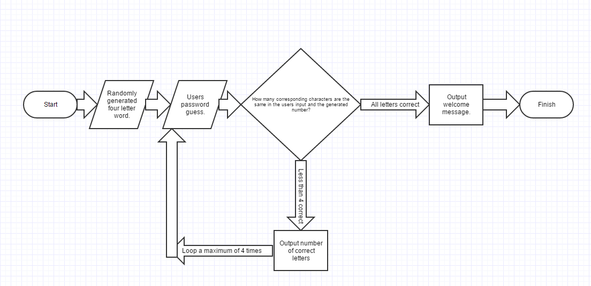

```START
password = GENERATE(Four letter word)      //Creates a four letter word.
attempts = 4 i = 4while(i>0)                             //Creates a while loop for each guess the user has.
likenessScore = 0     
userAttempt = User_Input                  //Asks the user for their guess of what the word is.
u = 0 while(u < 4)                          //While loop to check each of the characters in the password against the corresponding characters of the users input.    
userChar = userAttempt character at u      //Stores a single character for checking, from the users input.  
passChar = password character at u        //Stores a single character for checking, from the generated password.  
if(userChar = passChar)                  //Checks if the character from the users input is the same as the corresponding one in the password.     
likenessScore = likenessScore = 1           //If true the likeness score increases.  
End if u = u + 1                              //Line used to increase the value used in the second while loop. 
End while  
Print "Likness is: " + likenessScore     //Prints the likness score to the user.   
if(likenessScore = 4)    
Print "Welcome to the system."           //If the user has got the word correct the likness score will be 4. Therefore they will have succeded in the test. 
i=0                                    //Sets the value of i to 0 to end the loop.   
else  i = i - 1                       //Decreases i which represents the number of attempts left to the user.
End while


END  ```
